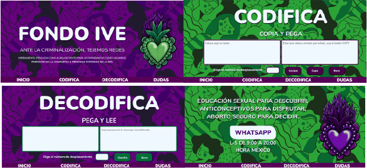

# Cifrado César Red de acompañamiento de Aborto

Aquí puedes ver la web app funcionando  [https://github.com/Azure/azure-content/blob/master/contributor-guide/contributor-guide-index.md](https://karlacrm.github.io/DEV001-cipher-karlaCRM.github.io/).
***

# Resumen del proyecto

Se nos planteo la tarea de realizar una aplicación web en donde nuestros usuarios fueran capaces de cifrar y descifrar un mensaje en el navegador mediante el uso del cifrado caesar y que a su vez fuera una posibilidad para las usuarias seleccionar el número (offset) de desplazamiento con el que querrian cifrar su mensaje. 
La idea principal esta planteada para que:

* El cifrador fuera capaz de cifrar MAYUSCULAS.
* Se pudiera cifrar el mensaje con un número de desplazamiento comprendido entre el 1 y el 33. 
* El mensaje cifrado apareciera en pantalla. 
* Se pudiera descifrar el mensaje previamente cifrado. 

### ¿Qué es el cifrado caesar?

Es un metodo de cifrado de texto de sustitución simple también conocido como cifrado por desplazamiento mediante el cual una letra es reemplazada por otra que se encuentra a determinado número de posiciones más adelante en nuestro alfabeto.
Un ejemplo sería si quisieramos cifrar la letra A con un desplazamiento de 2 espacios, entonces en vez de colocar la "A" esta sería sustituida por la "C".

## Problemática

El acceso al aborto  legal, seguro y gratuido en México actualmente y a pesar de que hace un año la Suprema Corte de Justicia de la Nación emitio un fallo a favor de la despenalizacion del aborto en el país (asento jurisprudencia) sigue siendo una cuestión que no termina de concretarse. De las 32 Entidades Federativas con las que consta el país, todavía existen 22 entidades que no han "dado su brazo a torcer" y en las cuales las mujeres todavía encuentran limitantes para abortar, siendo un daño directo a sus derechos fundamentales. 
Ciudad de México fue la primera entidad en despenalizar el aborto hasta la semana 12 de gestación, por ello se erigio como el "bastión" de la lucha por el derecho a abortar.
Aun así el aborto existe en todo el País y cientos (o miles) de mujeres abortan en el contexto de la clandestinidad, un aborto clandestino sin la información correcta o cuidados adecuados es inseguro, llevando a las mujeres a arriesgar su vida por el hecho de tomar decisiones sobre su propio cuerpo. 
Ante este panorama grupos de mujeres han tejido redes de apoyo para acompañar, auxiliar y permitir el acceso a mujeres de todo el país a un aborto seguro pues clandestino NO es sinonimo de inseguro. El aborto en casa con medicamento ha demostrado que con la información y el acompañamiento adecuados es altamente seguro. 
* Las mujeres que dan acompañamientos también arriesgan su integridad al compartir información o medicamentos a las mujeres en situación de aborto, siendo necesario buscar establecer estrategias que garanticen su seguridad.
* Las mujeres en situación de aborto aparte de tener que enfrentar un contexto de criminalización por parte del Estado también luchan contra el estigma social o la falta de apoyo familiar o de la pareja; ante esta situación muchas buscan el acompañamiento al encontrarse solas ante la decisión y su integridad corre riesgo si la desición que tomaron se llegará a saber en su nucleo cercano, ante esto también es necesario que cuenten con vías de comunicación seguras para enviar dudas o recibir información.

## 3. A quién va enfocado

Este proyecto fue pensado como herramienta de una Red de Acompañamiento de Aborto llamada "Fondo ILE" en donde usuarias fueran tanto las Acompañantes que comparten los protocolos y dan seguimiento a los abortos como a las mujeres que se acercan a la red solicitando información, dando datos respecto a semanas de embarazo o su contexto personal. 

La mayoria de los acompañamientos se dan de manera asincrona pues las mujeres que se acercan a la red leen los mensajes o responden cuando les es posible, siento mucho más seguro que el mensaje que reciban se encuentre cifrado y no al alcance de cualquiera. 

* Acompañantes de Fondo ILE
* Mujeres en situación de aborto

## 4. Cómo el proyecto resuelve sus problemas.

* Mediante el uso de la web app podrán comunicarse de manera "segura", está pensada como auxiliar en la comunicación por Whatsapp, una vez que la mujer que necesita acompañamiento contacta a la red, las Acompañantes le envían el acceso a la aplicación web y el número de offset en el cual estarán comunicandose. Así los textos se envian codificados al whats y una vez recibidos se decodifican. 
* La idea es generar un espacio más seguro de comunicación para ambas, evitando que cualquier persona que tenga acceso a su whats pueda entender aquello de lo que hablan. 

# 5. Proceso

Una vez recibido el proyecto, este se dividio en varías etapas, las cuales se describen a continuación: 

## 1. Diseño de prototipo base

Se realizo un esquema general a mano respecto a como quería que se viera, en el proyecto de "QUIZ" había realizado mi página unida por medio de varios HMTL y esta vez quería probar que todo se desplegara en una misma con una smooth transition; la idea fue enfocar el diseño (lo visual) a eso. 

  

  La idea es que la misma página se conecte directamente con el whatsapp de la asociación que es atendido por las acompañantes. 

## 2. Decisión de diseño

Se opto por un fondo en dos colores alucivos a la lucha por el acceso al aborto y el morado asociado a la lucha feminista, el patrón se descargó de freepik.
Se uso una ilustración hecha por mi para el 28s en México.
Se optó por una tipografía san serif pues genera bastante contraste y da la sensación de "modernidad". 
La intención era crear una página con un diseño fresco, alejado a la idea de "hospital" o servicio médico, pues no es la idea. El acompañamiento parte de la base de empoderar a las mujeres sobre su cuerpo y decisiones y no en simplemente prestar un servicio de salud. 

## 3. Diseño final

##  ¿Como se usa?

*  1. Se escribe en el área de texto lo que deseas codificar.
*  2. Se selecciona un número de desplazamiento (la idea es que la acompañante te especifique cual desde un principio)
*  3. Se da click en botón encriptar y posteriormente en botón copiar. El texto será copiado a portapapeles. 
*  4. El texto codificado se envia al whats. 
*  5. La usuaria recibe respuesta con el texto codificado por su whats , lo copia y pega en la sección morada de Descifrar. 
*  6. Establece el número de offset /desplazamiento y da click en Descifra. 

***
