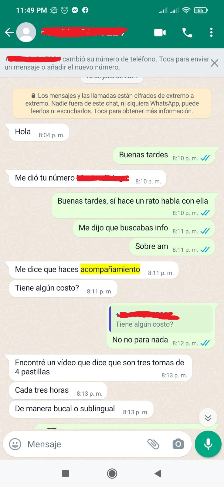
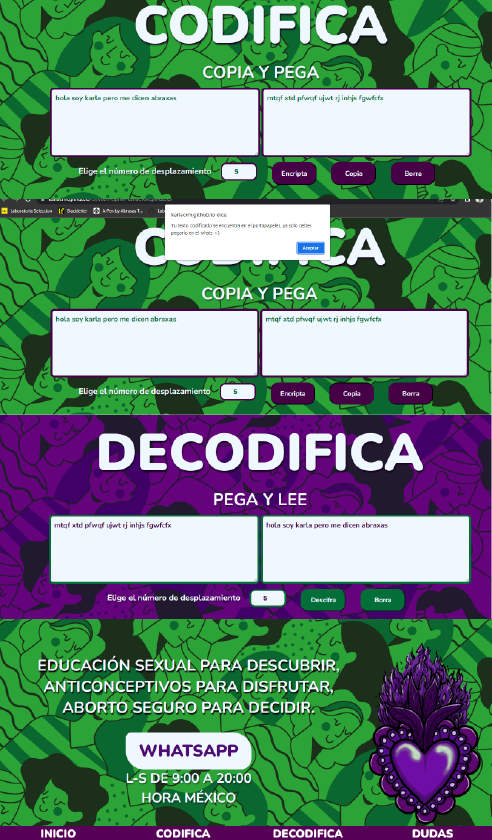

# Cifrado César Red de acompañamiento de Aborto

Aquí puedes ver la web app funcionando  [web app red de acompañamiento](https://karlacrm.github.io/DEV001-cipher-karlaCRM.github.io/).
***

# Resumen del proyecto

We were tasked with creating a web application where our users could encrypt and decrypt a message in their browser using the Caesar cipher, and where users could select the number (offset) they wanted to use to encrypt their message. The main idea was for:

* The cipher to be able to encrypt capital letters.
* The message could be encrypted with an offset number between 1 and 33.
* The encrypted message can be show on the screen.
* The previously encrypted message could be decrypted. 

### What is the Caesar cipher?

It is a simple substitution cipher method also known as a shift cipher, whereby a letter is replaced by another letter that is a certain number of positions ahead in our alphabet. For example, if we wanted to encrypt the letter A with a shift of 2 spaces, then instead of using "A", it would be replaced by "C".

## Complexitie

Access to legal, safe, and free abortion in Mexico is currently a matter that has not yet been fully realized, despite a Supreme Court ruling in favor of decriminalizing abortion in the country a year ago (establishing jurisprudence). Of the 32 federal entities in the country, there are still 22 that have not "given in" and in which women still encounter limitations to accessing abortion, which is a direct harm to their fundamental rights.

Mexico City was the first entity to decriminalize abortion up to 12 weeks of gestation, thus becoming the "stronghold" of the fight for the right to abortion.

However, abortion still exists throughout the country, and hundreds (or thousands) of women have abortions in the context of secrecy. A clandestine abortion without the correct information or adequate care is unsafe, leading women to risk their lives for the sake of making decisions about their own bodies.

In the face of this situation, groups of women have woven support networks to accompany, assist, and allow access to safe abortions for women throughout the country. Because clandestine does NOT mean unsafe, home abortion with medication has been shown to be highly safe with the appropriate information and support. 
* Women who provide support also risk their own safety by sharing information or medication with women seeking abortions, so it is necessary to establish strategies that guarantee their safety.
* Women seeking abortions not only face a context of criminalization by the state but also struggle against social stigma or lack of family or partner support. Faced with this situation, many seek accompaniment as they are alone in their decision, and their integrity is at risk if their decision were to become known in their close circle. Therefore, it is also necessary for them to have secure communication channels to send doubts or receive information.

## 3. Who is the target audience?

This project was designed as a tool for an Abortion Support Network called "Fondo ILE," where both Accompaniers who share protocols and follow up on abortions, as well as women who approach the network requesting information and providing data on their personal context, would be the users.

Most of the support is given asynchronously since women who approach the network read the messages or respond when it is possible for them, and it is much safer for the message they receive to be encrypted and not within anyone's reach.

* Accompaniers from Fondo ILE
* Women in need of abortion support

## 4. How does the project solve their problems?.

* The project solves the problem of secure communication between the women seeking support and the accompanying members of Fondo ILE by providing a web app. It is designed to assist communication through WhatsApp, and once a woman contacts the network seeking support, the accompanying members provide her with access to the web app and an offset number for communication. Text messages are then encrypted before being sent to WhatsApp and decoded upon receipt.
* The goal is to provide a safer space for communication for both parties, preventing anyone who has access to their WhatsApp from understanding what they are talking about.

# 5. Process

The project was divided into different stages.

## 1. Prototype design

The general layout was sketched by hand, outlining how it should look. In my previous project "QUIZ", I had created several HTML pages linked together, and this time I wanted to try having everything displayed on a single page with a smooth transition. The focus of the design was to achieve this transition and make it visually appealing.

  

## 2. Design 

We opted for a background in two colors alluding to the fight for access to abortion, with purple associated with the feminist movement. The pattern was downloaded from Freepik. I used an illustration I made for the September 28th movement in Mexico.

We chose a sans-serif typography as it generates enough contrast and gives a feeling of "modernity". The intention was to create a page with a fresh design, away from the idea of a "hospital" or medical service, as this is not the goal. The accompaniment is based on empowering women about their bodies and decisions, not just providing a health service.

##  ¿Como se usa?

*  1. Open the web app and type the text you want to encode in the text area.
*  2. Select a shift number (the idea is that the Accompaniers from Fondo ILE specifies it to you from the beginning).
*  3. Click on the "Encriptar" button and then on the "Copiar" button. The encrypted text will be copied to the clipboard.
*  4. Send the encrypted text to the accompaniers via WhatsApp.
*  5. The user receives a response with the encrypted text on WhatsApp, copies it, and pastes it into the purple "Descifrar" section of the web app.
*  6. Set the offset/shift number and click on "Descifra" to decode the message.

***
